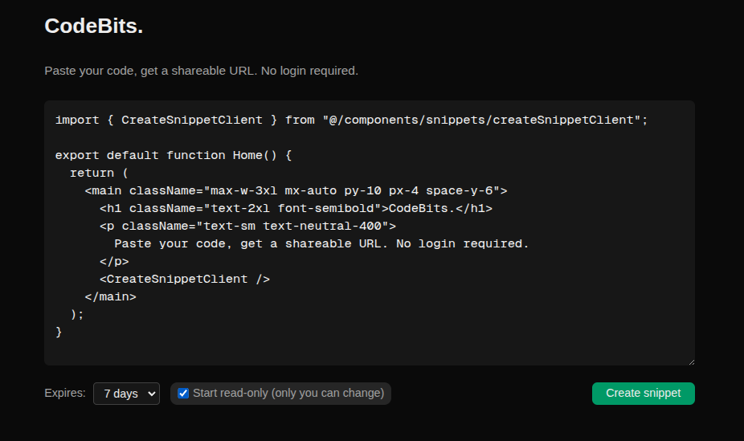
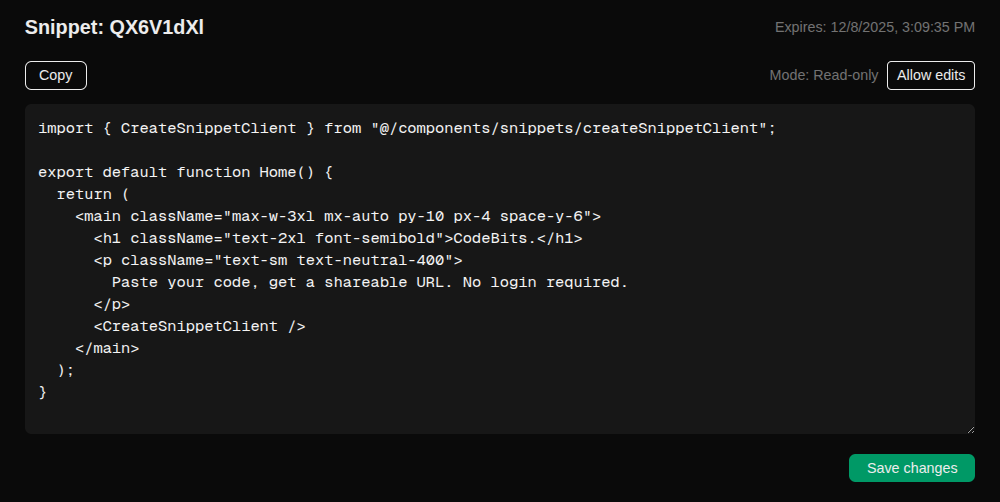

# CodeBits
A small web app where you can paste code and share it with anyone using a unique URL. No login needed. Built with **Next.js** and **Supabase**.

### What it does
- Lets you create a code snippet and get a shareable link.
- Anyone who opens the link can view (and sometimes edit) the code.
- The owner is identified using a cookie—no accounts or signup required.

`Creating snippet`

`Reading snippet`

### Features
- Language-agnostic editor (plain text, no linting or squiggles).
- Set `read-only` mode on creation (only you can edit).
- Toggle `read-only` later (owner only).
- **Set expiry:** 1 day, 7 days, or never.
- **Persistent edits** — changes stay saved in the database.
- `Copy` button for quick sharing.
- **Cookie-based ownership** — whoever created the snippet becomes its owner on that device/browser.

